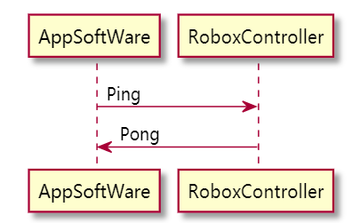

## 1.运动控制指令  
### 1.1. 说明
  1. 上位机发送笛卡尔运动命令给机器人，如：moveCart(X,Y,Z,A,B,C)；
  2. 上位机发送关节运动命令给机器人，如：moveJoint(J1,J2,J3,J4,J5,J6)
  3. 机器人需要返回执行状态给上位机

### 1.2 交互逻辑及指令
*整体交互逻辑*


#### 1.2.1 Command指令
Command用于启动一次机器人运动,主要包含cmd，frame，goal，以及cmd_id四个参数。
> **cmd参数**：
> * move：启动一次机器人运动，位置运动中统一设置为"move"
> 
> **frame参数**：
>* cart: 按照机器人笛卡尔坐标系位置运动
>* joint: 按照机器人关节位置信息运动
>* tool1: 按照tool1的笛卡尔坐标系运动
>* tool2: 按照tool2的笛卡尔坐标系运动
>* tool3: 按照tool2的笛卡尔坐标系运动
>* user1: 按照user1的笛卡尔坐标系运动
> 
> **goal参数**:
> * 符合frame格式要求的一个位置点，表示机器人的目标位置，
> 
> **cmd_id参数**
> * cmd_id为一个0-255之间的数字，用以系统通信时区分指令之间关系。
> * 与Response和Result指令返回的ack_id对应数字相同时，表示它们之间的对应关系

#### 1.2.2 Response指令
Response指令用于表示下位机器人系统是否成功接收到上位发送的指令。主要包含response、error_code和ack_id三个参数
其接收成功时只需返回一个参数response，用于表明成功接收；
接收失败时返回response和error_code。
> **response参数**
> * success: 表示接收成功
> * fail: 表示接收失败
> 
> **error_code参数** 错误代码，指明失败原因
> * 0010: 系统不在可运行状态
> * 0020: 规划失败
> 
> **ack_id参数**
> 与Command指令中的cmd_id数值相同，表示指令之间的对应关系

#### 1.2.3 Result指令
Result指令用于向上位系统返回机器人执行Command指令的结果。
其包含result，erros_code和ack_id三个参数

> **result**
> * success: 成功完成指令要求的内容
> * fail: 未能成功执行 
> 
> **error_code**
> * 0010: 奇异点
> * 002X: 轴超界，X表示第X轴
> * 0030: 急停，外部干预导致机器人急停
> * 0090: default，其他错误
> 
> **ack_id参数**
> 与Command指令中的cmd_id数值相同，表示指令之间的对应关系

### 1.3 示例
示例1
发送目标位置（笛卡尔坐标）
```json
// command
{
  "cmd": "move",
  "frame": "cart",
  "goal": [0, 0, 0, 0, 0, 0],
  "cmd_id": 123
}

// response
{
  "response": "success",
  "ack_id": 123
}

// result
{
  "result": "success",
  "ack_id": 123
}
```

示例2
发送目标位置（关节坐标）

``` json
// command
{
  "cmd": "move",
  "frame": "joint",
  "goal": [0, 0, 0, 0, 0, 0],
  "cmd_id": 234
}

// response
{
  "response": "fail",
  "error_code": 0100,
  "ack_id": 234
}

// result 
{
  "result": "fail",
  "error_code": 0100,
  "ack_id": 234
}
```

## 2.路径控制指令
### 2.1 说明
1. 上位机一次发送多个运动参数（最多30个位置）给机器人，运动参数的形式支持以下三种：
   1. 插补方式（关节/笛卡尔）+ 位置 + 过度参数
   2. 插补方式（关节/笛卡尔）+ （位置，速度，时间戳） + 过度参数
   3. 插补方式（关节/笛卡尔）+ （位置，速度，加速度，时间戳） + 过度参数
2. 每个点之间的运动平滑过渡，保证速度的连续性（建议采用flyCart函数）
3. 在机器人开始运动前能够检查运动参数的合理性检查，比如限位，限速，奇异位等，并返回状态给上位机

### 2.2 交互逻辑及指令
#### 2.2.1 Command指令
Command指令用于控制机器人完成一段轨迹的运动
其包括cmd，frame，goal，cmd_id四个参数
> **cmd参数** 用于指明该帧数据用于实现机器人运动
> * move_path: 按照给出的轨迹点运动
> * move_trajectory: 按照轨迹运动，轨迹包含速度、加速度、时间戳信息
> 
> **frame参数**表明数据的格式，其中
> * cart: 机器人笛卡尔坐标系
> * joint: 关节坐标系
> * tool1: 按照tool1的笛卡尔坐标系运动
> * tool2: 按照tool2的笛卡尔坐标系运动
> * tool3: 按照tool2的笛卡尔坐标系运动
> * user1: 按照user1的笛卡尔坐标系运动
> 
> **goal参数** 
> * 根据frame格式要求生成的多个点组成的运动轨迹
> * 当cmd参数为move_trajectory时，goal中点的轨迹还要包含速度、加速度、时间戳等信息。
> 
> **cmd_id参数**
> 与其他指令的cmd_id参数意义相同

#### 2.2.2 Response指令
Response指令用于表示下位机器人系统是否成功接收到上位发送的指令。主要包含response，error_code和ack_id三个参数。
> **response参数**
> * success: 表示接收成功
> * fail: 表示接收失败
> 
> **error_code参数** 错误代码
> * 0010: 轨迹不合理，无法实现
> * 0020: 机器人未处于正确可运行状态
> * 0030: default，其他
> 
> **ack_id参数**
> 与Command指令中的cmd_id数值相同，表示指令之间的对应关系

#### 2.2.3 Result指令
Result指令用于向上位系统返回机器人执行Command指令的结果。
其包含result，erros_code和ack_id三个参数

> **result**
> * success: 成功完成指令要求的内容
> * fail: 未能成功执行 
> 
> **error_code**
> * 0010: 外部急停
> * 0090: default，其他错误
> 
> **ack_id参数**
> 与Command指令中的cmd_id数值相同，表示指令之间的对应关系

2.3 示例
``` json
// command
{
  "cmd": "move_path",
  "frame": "cart",
  "goal": {
    "[0, 0, 0, 0, 0, 0]",
    "...",
    "[0, 0, 0, 0 ,0, 0]"
  },
  "cmd_id": 110
},

// response
{
  "response": "success",
  "ack_id": 110
},

{
  "response": "fail",
  "error_code": 0200,
  "ack_id": 110
},

// result
{
  "result": "fail",
  "error_code": 0100,
  "ack_id": 110
}, 
```

## 3.跟踪拍摄命令
### 3.1 说明 
  1. 在设定的某一位置开始，机器人开始跟踪传送带上的目标物体并进行拍照，机器人的跟踪距离可以设定；
  2. 在跟踪的过程中，保持机器人末端与跟踪物体距离固定的情况下，机器人能够多次变换姿态对物体进行拍摄，并保存末端法兰与工件坐标系间的旋转矩阵
  3. 在保证功能实现的前提下，尽量保证跟踪精度在0.5mm，并支持缓存多组工件坐标系
  4. 机器人姿态变换次数由上位决定 

### 3.2 交互逻辑及指令

#### 3.2.1 Command指令
该指令用于控制相机对传送带的物体进行跟踪拍摄，机器人需要实现相机与物体距离的相对固定，其参数包含cmd，distance。
其中distance参数用以设置相机与目标物体的距离
> **distance参数**
> * 设置相机与目标物体之间的距离
> 
> **cmd参数**
> * stop: 停止进行追踪拍摄
> * run: 继续追踪
> 
> **cmd_id参数**
> 与其他指令的cmd_id参数意义相同

#### 3.2.2 Response指令
与其他命令中Response格式及意义相同。

#### 3.2.3 Result指令 
有三种返回结果，追踪成功，追踪失败

### 3.3 示例
``` json
// command
{
  "cmd": "track",
  "distance": 12,
  "trans_times": 4, 
  "cmd_id": 101
}

// response
{
  "response": "success",
  "ack_id": 101
}
{
  "response": "fail",
  "ack_id": 101
}

// result
{
  "result": "success",
  "ack_id": 101
}
```

### 3.4 切换坐标系指令
#### 说明
对传送带的新的目标物体进行追踪。
#### 交互逻辑
#### Command
切换坐标系，主要有两个参数cmd与cmd_id。
> cmd参数
> * shift_transform: 表示切换坐标系 

#### Result
三种返回结果，成功，失败，以及当前无法进行切换。
> result参数
> * success: 切换成功 
> * fail: 切换失败
> * busy: 系统正忙，无法进行切换

#### 示例
``` json
// command
{
  "cmd": "shift_transform",
  "cmd_id": 123
}

// result
{
  "result": "busy",
  "ack_id": 123
}
```


## 4.停止
### 4.1 说明
上位机发送运动停止指令给机器人，机器人以最快的速度停止
### 4.2 交互逻辑
#### 4.2.1 Command指令
该指令用于实现机器人在任何状态下的快速停止。
该指令除cmd_id之外，不需要其他参数。
> * cmd_id为一个0-255之间的数字，用以系统通信时区分指令之间关系。
> * 与Response和Result指令返回的ack_id对应数字相同时，表示它们之间的对应关系

#### 4.2.3 Result指令 
与其他命令中Result格式及意义相同。


### 4.3 示例
``` json
// command
{
  "cmd": "stop",
  "cmd_id": 100
},

// result
{
  "result": "success",
  "ack_id": 100
}
```

## 5.读取机器人当前状态信息指令
### 5.1 说明
  1. 上位机发送读取当前关节位置指令，控制器返回消息如PointJ（J1,J2,J3,J4,J5,J6）
  2. 上位机发送读取当前机器人末端位置，控制器返回消息如PointT(x,y,z,a,b,c)
  3. 上位机发送读取当前工件坐标系参数,控制器返回消息如下两种形式:
     1. Transform(trasX,trasY,transZ,rotZ,rotY,rotX
     2. Transform(trasX,trasY,transZ,rotMatrix[3][3])
  4. 最好一帧包含全部信息，确保数据同步

### 5.2 交互逻辑及指令
#### 5.2.1 Command指令
该指令用于获取机器人的当前状态，主要获取各种表示方式的位置信息等。
其参数包括require和cmd_id两个参数。
其中require表示具体需要的机器人状态信息，根据require的内容可以获取机器人的全部信息，也可以获取需要的部分信息。
> **require参数**
> * all: 表示获取机器人所有状态信息（即以下所有内容）
> * point_j: 获取机器人关节位置
> * point_t: 获取机器人在笛卡尔坐标系下的位置信息
> * transform: 工件坐标系
> 
> **cmd_id参数**
> 与其他指令的cmd_id参数意义相同

#### 5.2.3 Result指令
返回机器人的状态信息，其中
> point_j: 表示机器人关节位置
> point_t: 机器人在笛卡尔坐标下的位置
> transform: 当前工件坐标系参数
> ack_id: 与cmd_id对应

### 5.3 示例
``` json
// command
{
  "cmd": "get_status",
  "frame": "all",
  "cmd_id": 12
}

// result
{
  "result": "success",
  "point_j": [0, 0, 0, 0, 0, 0],
  "point_t": [0, 0, 0, 0, 0, 0],
  "transform_1": [0, 0, 0, 0, 0, 0],
  "transform_2": { },
  "ack_id": 12
}
```

## 6. 清除报警指令
### 6.1 说明
该指令用于系统出现异常或其他情况时，清除系统报警。

### 6.2 交互逻辑及指令

#### 6.2.1 Command指令
指令主要包含cmd和cmd_id两个参数，其中cmd用以表示该指令的类型。
> **cmd参数** 
> * clear_error: 清除系统报警信息
> 
> **cmd_id参数**
> * cmd_id为一个0-255之间的数字，用以系统通信时区分指令之间关系。
> * 与Response和Result指令返回的ack_id对应数字相同时，表示它们之间的对应关系
#### 6.2.2 Result指令
与其他指令意义及格式相同

### 6.3 示例
``` json
{
  "cmd": "clear_error",
  "cmd_id": 34
},

{
  "result": "success",
  "ack_id": 34
}
```

## 7. 测试通信指令
### 7.1 说明
该指令主要于系统空闲时测试系统的通信情况，因此交互内容中不包含重要信息。
仅测试系统连通情况。

### 7.2 交互逻辑 


#### 7.2.1 Command指令
向机器人系统发送数据以测试上下位系统的通信情况。
主要包含cmd和cmd_id两个参数。
cmd用以说明该指令的类型
> **cmd参数**
> * ping: 用于测试系统通信是否正常

#### 7.2.2 Response指令
response返回ping指令执行情况，如果返回pong，表示通信正常。
> **response参数**:
> * pong: 通信正常
> 
> **ack_id参数**:
> 与cmd_id对应

### 7.3 示例
``` json
// command
{
  "cmd": "ping",
  "cmd_id": 125
},

// Response
{
  "response": "pong",
  "ack_id": 125
},

```

## 8. Error Code Table
| code | meaning |
| --- | --- |
| 0100 | 
| 0200 |
| 030X | 
